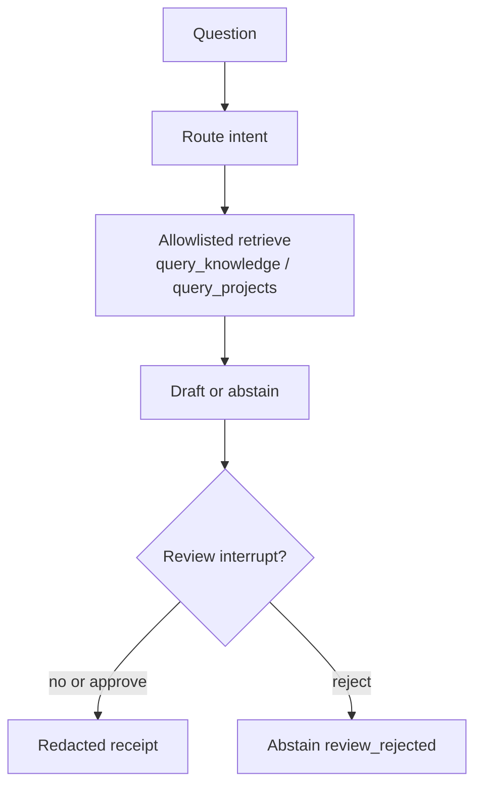

# How Harbor is wired

Harbor is a small loop: route a question, retrieve from two labelled indexes, draft or abstain, optionally pause for review, then write a redacted receipt.

The framework-free pipeline is the control. LangGraph is a wrap of those same functions. If the graph disagrees with the baseline on the fixture suite, the graph is wrong.

## Nodes

The LangGraph wrap uses five named nodes: `route`, `retrieve`, `draft`, `review`, `emit_receipt`.

| Node | What it does | Fail closed when |
|---|---|---|
| `route` | knowledge, project, or federated | scopes must match intent |
| `retrieve` | two labelled tools only | unknown or write-shaped names |
| `draft` | extractive default; Ollama/hosted optional | missing provider, invented citation paths, injection |
| `review` | optional interrupt | approve still cannot add tools |
| `emit_receipt` | hash of paths, outcome, tools, provider | question text, snippets, planted secrets |

Federated questions query both indexes. They never return one unlabelled list. That split is a type invariant, not a prompt instruction.

## Timeout semantics

The fixture tool client gives each retrieval call a wall-clock budget. When the
budget expires, it shuts down the one-shot worker without waiting for it, so the
caller receives `ToolTimeout` within the budget plus small scheduling slack.
Python threads cannot be forcefully killed, so a worker that is already running
may finish in the background. Returning control to the caller is the guarantee;
hard worker termination would require a process or an async backend with
cancellation support.

## What is outside this diagram

Ollama and hosted sit behind `--provider`. They are not in the default path.

The Harbor MCP server exports the same two read-only tools. Handlers are synchronous FastMCP functions. I did not wire asyncio, Celery, or Temporal here. The allowlist, schema, and timeout are the contract I would keep if retrieve moved onto async handlers or a worker so a one-thread pool does not starve under concurrent MCP calls. Live MindGraph is a fail-closed adapter and is not enabled in CI.

Temporal, Airflow, Prefect, and n8n are a mapping note, not boxes in this graph. See [`workflow-portability.md`](workflow-portability.md).

## Proof

`tests/test_graph.py` checks that baseline and graph fixture decisions match, including receipt hashes. `grounded-agent demo` reruns the reviewer cases, including that graph match.
